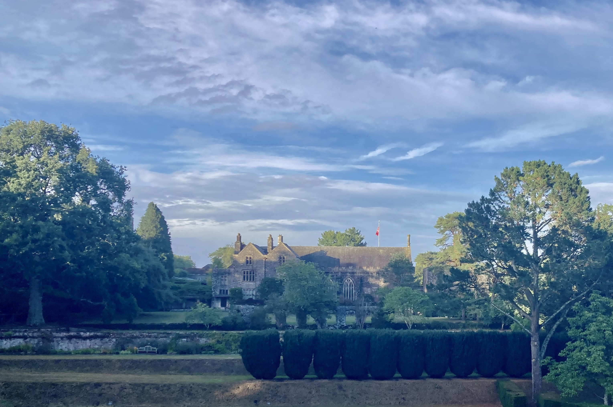

:orphan: true

.. title:: CCP-DCM Use case Hackathon

Use case Hackathon 12-14 May 2025
---------------------------------

* Are you interested in making better use of Firedrake or FEniCS or an
  application based on them?
* Would you like to showcase your work with Firedrake or FEniCS?
* Would you like future developments to cater to your application needs?
* Could you use some input from the developers?
* Would you just enjoy 3 days of programming your model in a beautiful setting
  in Devon?

If the answer to any of these questions is yes, join us at the use case
hackathon.

What
----

Bring an example of the sort of computation you do in Firedrake, FEniCS, or a
package built on these such as Gusto. Over the hackathon we'll work with you to
produce a release quality demo showcasing your problem. This is your chance to:

* showcase your work to the community by contributing a demo like those in 
  `FEniCS <https://docs.fenicsproject.org/dolfinx/main/python/demos.html>`__ and
  `Firedrake
  <https://www.firedrakeproject.org/documentation.html#advanced-tutorials>`__.
* work with developers to improve your code.
* highlight the future changes and features that would enable you to do more
  and better science.

Where
-----

`Dartington Hall <https://www.dartington.org/visit/>`__, Totnes, Devon

Key Dates
---------
* 31 March Registration deadline
* 12-14/5/2025 Hackathon

Registration
------------

Registration will be £50. This includes two nights accommodation at
Dartington Hall, meals and participation in the hackathon itself.

Further details
---------------

For any queries, please contact `Jemma Shipton <mailto:j.shipton@exeter.ac.uk>`__
