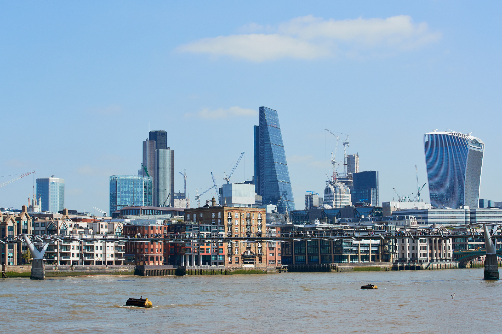

:orphan: true

.. title:: CCP-DCM Scoping meeting

.. image:: _static/firedrake.png
   :target: https://firedrakeproject.org
   :align: left
   :width: 15%

.. image:: _static/fenics_logo.png
   :target: https://fenicsproject.org
   :align: right
   :width: 15%

Collaborative Computing Project on Data-centric Continuum Mechanics
===================================================================

Scoping Meeting, London, 3 June 2025
------------------------------------

The `Science and Technology Facilities Council
<https://www.ukri.org/councils/stfc/>`__ has funded work towards potentially
establishing a new `Collaborative Computational Project
<https://www.ccp.ac.uk>`__ centred on the Firedrake and FEniCS projects.

This is a long-term opportunity in support of the science and engineering that
high productivity, high performance computational mechanics simulation enables.

The scoping meeting is an opportunity for this entire community to shape the
objectives and development of the software capabilities which will enable high
impact science and engineering breakthroughs across the UKRI remit.

Who?
----

We are inviting representatives developers and users of:

* Existing and potential projects using Firedrake or FEniCS in any application area.
* Tools that build on Firedrake or FEniCS.
* Underpinning technology such as solvers, optimisation libraries and compilers.
* Hardware and system software critical to simulation performance.

What
----

Help us define the key priorities for supporting and developing Firedrake and
FEniCS, and their applications, over the coming years:

* What science and engineering breakthroughs would improved simulation software
  capabilities enable?
* What development and support are required for this to happen?
* What are the critical unmet community needs we could and should meet?
* What changes in the hardware, software or application environments must
  we address in order to maintain and increase their community value?
* What steps would best strengthen and grow this community?

Key Details
-----------

The meeting will be held in person in central London on 3 June 2025. Support
for travel and, where needed, accommodation will be provided.

Registration
------------

If you would like to participate, please contact `David Ham
<mailto:David.Ham@imperial.ac.uk>`__
